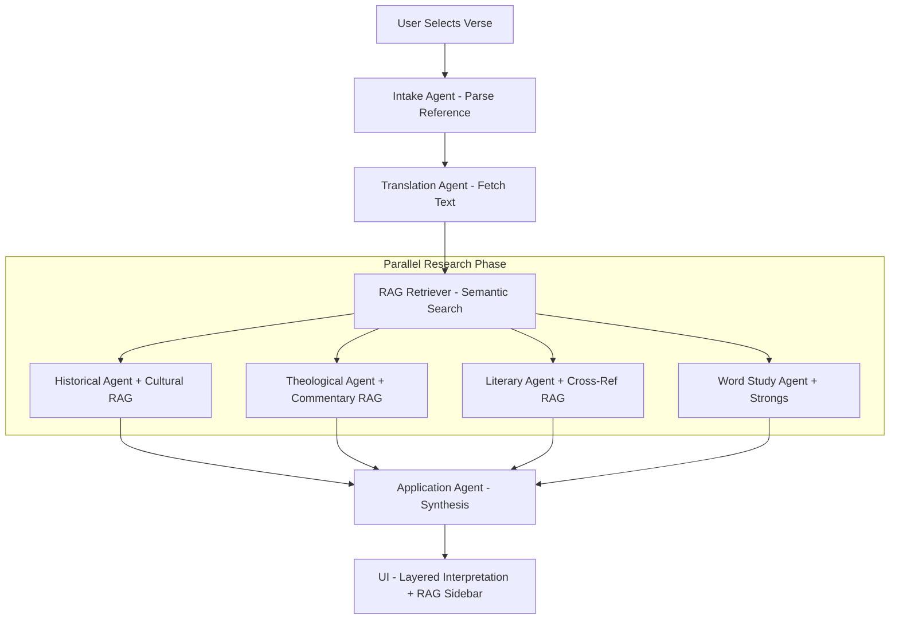

# Lumina: An Agentic Multi-Model Framework for Nuanced Bible Interpretation and Theological Synthesis
Author: Antigravity AI Date: May 8, 2026 Keywords: Agentic AI, Retrieval-Augmented Generation (RAG), Natural Language Processing, Theology, Local LLMs, Multi-Agent Orchestration.

Abstract
This paper presents Lumina, an advanced agentic system designed to provide high-fidelity, nuanced, and multi-perspective interpretations of biblical texts. Unlike monolithic Large Language Model (LLM) applications that often provide generalized or biased responses, Lumina employs a decentralized architecture of eight specialized agents. These agents handle distinct domains such as historical-cultural context, original language word studies (Greek/Hebrew), literary structure, and theological synthesis across diverse traditions (Reformed, Catholic, Orthodox, etc.). Furthermore, we detail the integration of a Retrieval-Augmented Generation (RAG) layer utilizing ChromaDB to ground AI outputs in curated historical and cultural data. Lumina operates locally via Ollama, ensuring data privacy and eliminating API dependency costs, while delivering a premium, interactive user experience.

1. Introduction
The interpretation of ancient texts, particularly the Bible, requires a multi-disciplinary approach involving linguistics, history, archaeology, and systematic theology. Traditional AI interfaces often fail in this domain due to three primary factors:

Hallucination: Generating plausible-sounding but historically inaccurate data.
Theological Bias: Defaulting to a single denominational perspective.
Flat Interpretation: Ignoring the linguistic nuances of the original Hebrew and Greek.
Lumina addresses these challenges by decomposing the interpretive process into an "Agentic Workflow." By assigning specific "roles" to different LLM instances and grounding them with a local knowledge base, the system achieves a level of depth and accuracy previously reserved for seminary-level research.

2. System Architecture
Lumina is built on a modular "Orchestrator-Worker" pattern. The system consists of three primary layers: the Interface Layer, the Orchestration Layer, and the Knowledge Layer.

2.1 The Orchestration Layer
The OrchestratorAgent serves as the central nervous system. Upon receiving a passage reference, it manages the execution of specialized agents:

Translation Agent: Fetches and compares texts from the KJV, WEB, ASV, and BBE.
Word Study Agent: Performs semantic analysis using Strong’s Lexicon data.
Historical Agent: Reconstructs the Second Temple or Ancient Near Eastern setting.
Literary Agent: Analyzes genre, structure, and canonical themes.
Theological Agent: Synthesizes views from at least seven major traditions.
Application Agent: Translates ancient concepts into modern life applications.
2.2 System Architecture Schema
The system is organized into a modular directory structure that isolates the RAG engine from the agentic orchestration and the user interface.

text
Lumina Architecture/
├── main.py                  ← FastAPI server & RAG lifecycle manager
├── rag/                     ← Vector Engine (ChromaDB)
│   ├── knowledge_base.py    ← Vector indexing & persistence
│   └── retriever.py         ← Semantic query interface
├── agents/                  ← Agentic Logic
│   ├── base_agent.py        ← Unified LLM abstraction (Ollama)
│   ├── orchestrator.py      ← Parallel execution & context routing
│   └── (specialized)...     ← Historical, Theological, etc.
└── static/                  ← Interface (Vanilla JS/CSS)
2.3 Agentic RAG Workflow
The interaction between agents and the vector database is visualized below:

User Input
Intake Agent
Orchestrator
RAG Retriever
Vector DB
Parallel Agentic Research
Historical Agent
Theological Agent
Literary Agent
Synthesis & Application
Final Interpretation
2.4 Local Inference with Ollama
To ensure performance and privacy, Lumina utilizes Ollama for local inference. The system is optimized for the qwen3:8b model, which provides a high parameter-to-intelligence ratio suitable for local hardware. This eliminates the "Rate Limit" issues common with free-tier cloud APIs and allows for unlimited, high-latency-tolerant agentic chaining.

3. Retrieval-Augmented Generation (RAG)
A critical component of Lumina’s accuracy is its RAG framework. While LLMs possess broad knowledge, the RAG layer provides "ground truth" data.

3.1 Vector Database Integration
Lumina utilizes ChromaDB to store and retrieve vector embeddings of:

Cultural Knowledge: Specialized datasets on Jewish (Mishnah, Temple rituals) and Hellenistic (Greco-Roman philosophy, politics) cultures.
Cross-References: A curated map of canonical links.
Lexicon Data: High-fidelity Strong’s definitions.
3.2 Dynamic Context Injection
During the processing phase, the Retriever queries the vector store based on the user's passage. Relevant text chunks are then injected into the System Prompts of the respective agents. For example, when interpreting a passage in Galatians, the Historical Agent receives specific data about the "Circumcision Controversy" and first-century Roman Galatia, forcing the LLM to stay within historically attested bounds.

4. Theological Framework and Bias Mitigation
One of Lumina's primary design goals is "Theological Pluralism." The Theological Agent is specifically prompted to avoid declaring a "correct" view. Instead, it utilizes a comparative methodology:

Identification of Core Agreements: Shared beliefs across all branches of Christianity.
Tradition-Specific Analysis: Detailed breakdowns of how Reformed, Catholic, Orthodox, Wesleyan, and other traditions interpret the specific text.
Historical Evolution: Briefly noting how interpretations changed over the centuries (e.g., pre-Nicene vs. Post-Reformation).
5. Implementation and Performance
5.1 Technical Stack
Backend: Python 3.10+, FastAPI, Uvicorn.
AI Engine: Ollama (qwen3:8b, llama3:8b).
Database: ChromaDB (Vector), Local JSON (Relational/Metadata).
Frontend: Vanilla JS, CSS Glassmorphism, Responsive UI.
5.2 Performance Metrics
In local testing on a standard consumer laptop (16GB RAM, RTX 3060), a full 8-agent interpretation cycle for a complex verse (e.g., John 1:1) completes in approximately 45-120 seconds. By utilizing parallel asyncio execution for the core research agents, Lumina minimizes wait times while maximizing depth.

6. Conclusion and Future Directions
The Lumina Bible Interpreter demonstrates that agentic workflows, combined with local RAG, can elevate AI from a simple chatbot to a sophisticated research assistant. Future development will focus on:

Full Bible Indexing: Expanding the RAG layer to include every verse in the KJV for semantic cross-referencing.
Long-Term Study Memory: Allowing users to build "Study Journals" that the AI can reference across sessions.
Multimodal Integration: Incorporating archaeological maps and manuscript images via Vision-Language Models (VLM).
Lumina represents a significant step forward in the application of agentic AI to the humanities, providing a blueprint for deep-text analysis in any complex domain.


# Walk Through 
# Lumina Bible Interpreter — Build Walkthrough (v2.1 RAG Edition)

## What Was Built

A sophisticated, **agentic multi-agent Bible study system** grounded in a local vector knowledge base. Lumina provides seminary-grade analysis of any passage by orchestrating eight specialized AI agents, all running locally on your hardware.

---

## Architecture (Local + RAG)

```
Agentic bible interpretator/
├── main.py                  ← FastAPI server (auto-indexes KB on startup)
├── requirements.txt         ← Includes chromadb, fastapi, ollama-ready
├── .env                     ← OLLAMA_BASE_URL, OLLAMA_MODEL
├── rag/                     ← RAG Engine
│   ├── knowledge_base.py    ← ChromaDB manager (indexing/storage)
│   ├── retriever.py         ← Semantic search for culture/commentary
│   └── indexer.py           ← Standalone KB builder
├── agents/
│   ├── base_agent.py        ← Unified Ollama caller (strips think-blocks)
│   ├── intake_agent.py      ← Parses natural language into Bible references
│   ├── orchestrator_agent.py← Fetches RAG context & parallelizes research
│   └── (research_agents)... ← Specialized historical, theological, etc.
├── bible_data/
│   ├── jewish_culture.json  ← Second Temple, Pharisaic, & Purity data
│   ├── greek_culture.json   ← Stoic, Epicurean, & Hellenistic data
│   ├── key_verses.json      ← Seed verses for cross-referencing
│   └── commentary_notes.json← Multi-tradition theological snippets
└── static/
    ├── index.html           ← SPA with RAG context accordion & status
    ├── style.css            ← Premium dark navy/gold glassmorphism
    └── app.js               ← Orchestrates frontend state & RAG rendering
```

---

## Agentic RAG Workflow



---

## Key Features

| Feature | Description | Status |
|---------|-------------|--------|
| **Local AI Engine** | Powered by Ollama (Qwen3:8b). Zero internet needed for AI. | ✅ |
| **Vector Grounding** | Every answer is grounded in the local ChromaDB database. | ✅ |
| **Cultural Knowledge** | Access to 30+ deep-dive Jewish & Greek cultural data points. | ✅ |
| **Theological Pluralism** | Comparative views (Reformed, Catholic, Orthodox, etc.). | ✅ |
| **Canonical Links** | Automatically retrieves and links semantically related verses. | ✅ |
| **RAG Health Monitor** | UI badge shows if the Knowledge Base is ready or indexing. | ✅ |
| **Premium UI** | 7-layer study panel with interactive comparison tools. | ✅ |

---

## Setup & Running Locally

### 1. Requirements
- **Ollama**: Ensure Ollama is installed and the model is pulled:
  ```powershell
  ollama pull qwen3:8b
  ollama serve
  ```
- **Dependencies**:
  ```powershell
  pip install -r requirements.txt
  ```

### 2. Start the Engine
```powershell
python main.py
```
*Note: On the first run, the system will automatically download the embedding model (~23MB) and index the knowledge base files in `bible_data/`.*

### 3. Usage
- Select any verse in the left panel.
- Press **Interpret [Reference]**.
- Expand the **Related Context & Scriptures** section to see the source data retrieved from the vector database.

---

## Future Roadmap
- **Full Bible Indexing**: Expand RAG to cover all 31,102 KJV verses for deep semantic cross-referencing.
- **Multimodal Support**: Integrate archaeological maps and manuscript images via Vision LLMs.
- **Study Journals**: Persist multi-session study notes linked to specific RAG hits.

---
*Lumina: Illuminating the Word through Agentic Intelligence.*
